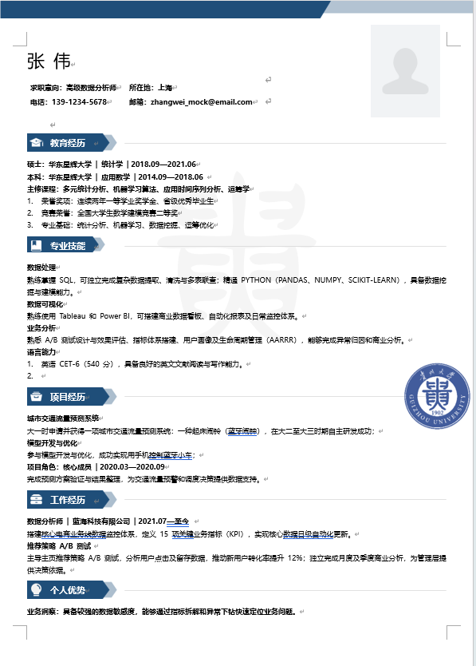

## 一键安装与使用 (Installation)

复制到 Codex、Claude Code 一键安装命令为：

```bash
npx skills add [https://github.com/ELECTG/resume-maker-skill-gzu](https://github.com/ELECTG/resume-maker-skill-gzu) --skill resume-maker-skill-gzu
```

[简历结果图

# 简历定制 Skill

针对具体岗位申请优化简历，采用适合 ATS（申请人跟踪系统）识别的格式，并进行关键词优化。

## 快速开始

将 `SKILL.md` 的内容复制并粘贴到 Claude 中，然后提供你的简历和目标岗位招聘信息。

## 功能说明

- 分析职位描述中的关键要求
- 突出与目标岗位相关的经历
- 针对 ATS（申请人跟踪系统）进行优化
- 建议使用量化成果改写经历要点
- 适用于任何行业和不同资历层级

## 示例

**你：** 这是我的简历，以及 Google 高级产品经理岗位的招聘信息。

**Claude：** 提供关键词分析、针对岗位定制的简历版本，以及附有说明的具体修改内容。
